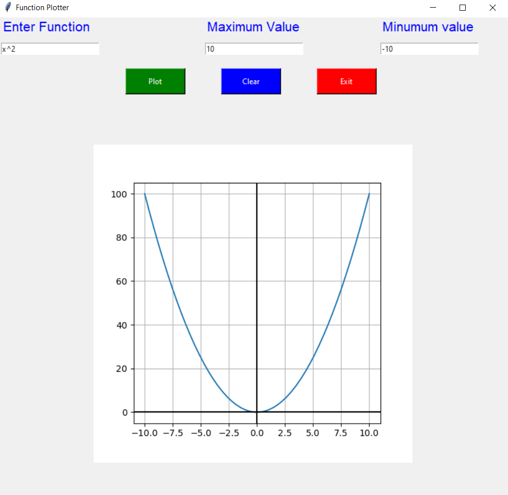
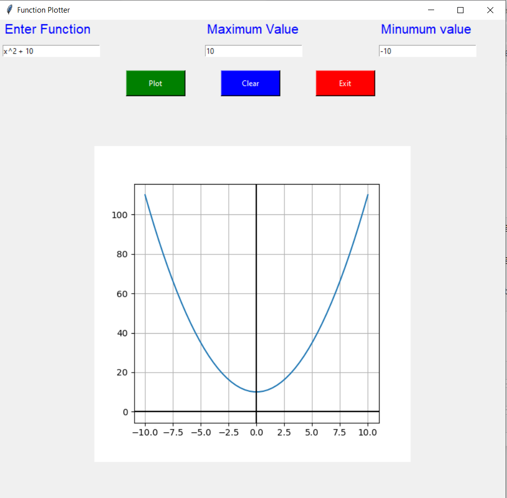
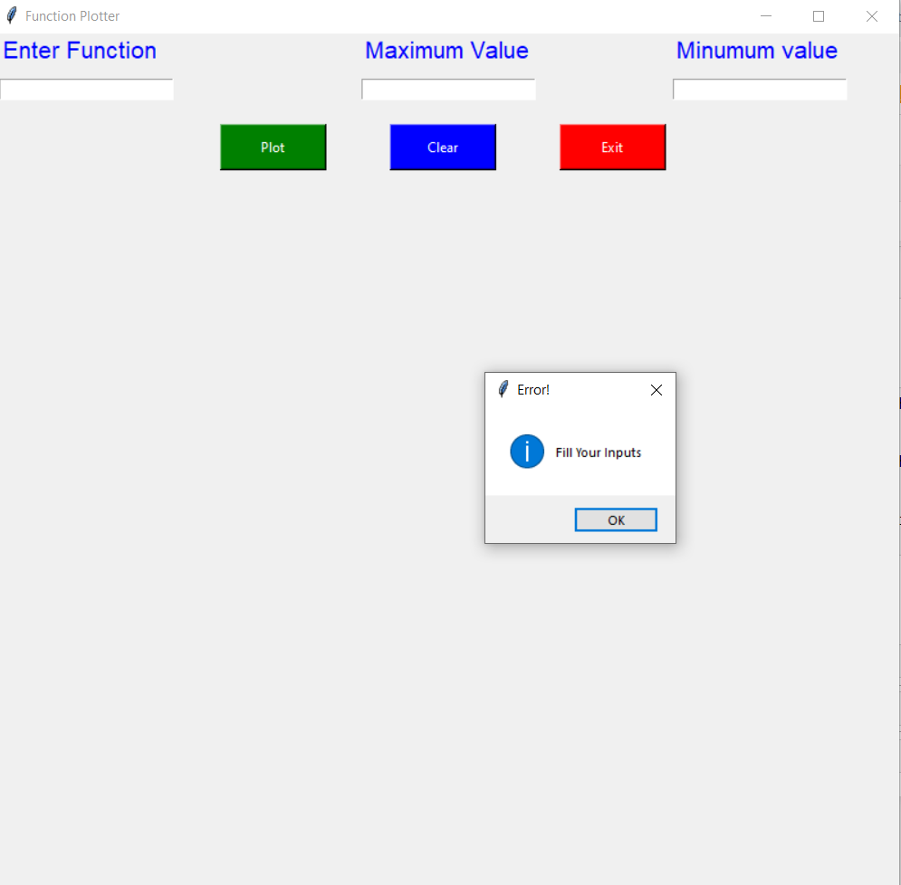
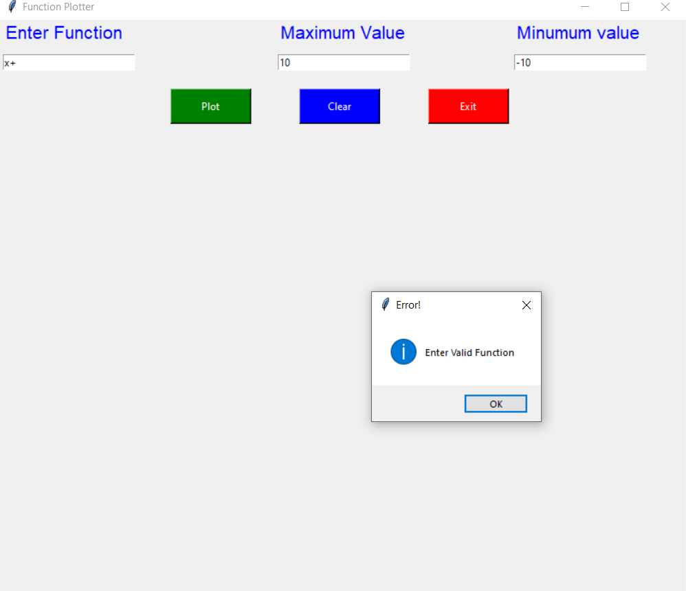
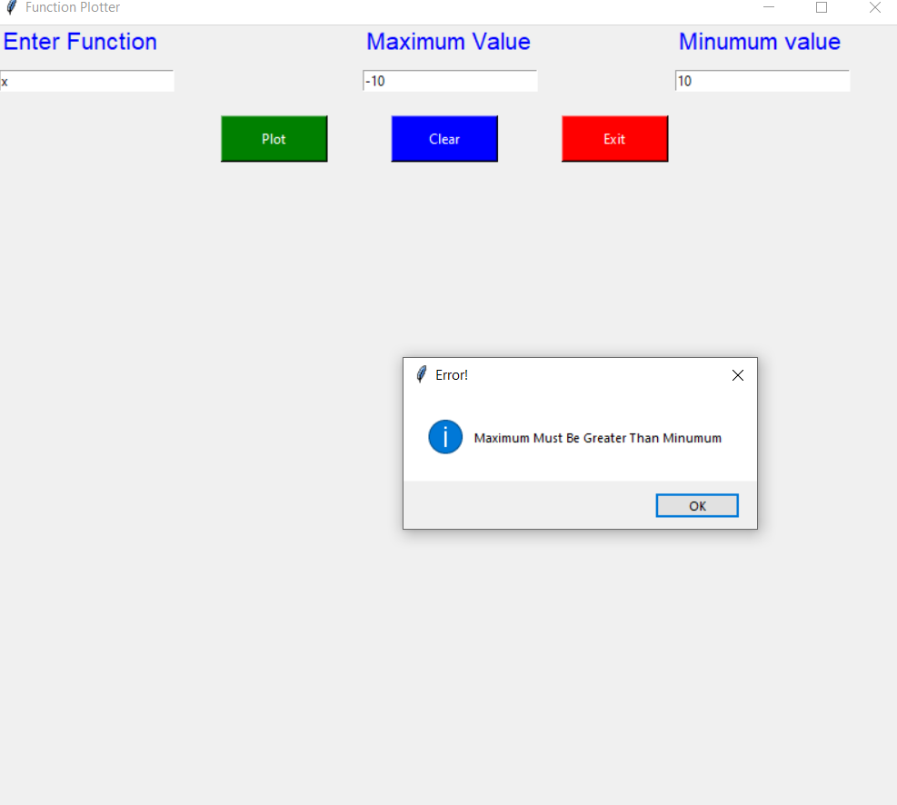

# Function-Plotter

## 📙About
A GUI program that plots arbitrary user-entered function.
## 🏁Getting Started
- You only need IDE to run this code like Vscode.
- Install Visual Studio Code.
- Install the necessary Jupyter notebook extensions.
- Create a Python environment and install the Jupyter
module.
- Run .ipynb file.
## 💻Built Using
- Python
## 📷Screenshots
### Valid Examples

### ERRORS

### contributors 

